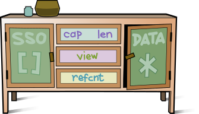

# Buffet

*All-inclusive Buffer for C*  
(Experiment - not yet stable or optimized)  

:orange_book: [API](#API)  


  

*Buffet* is a polymorphic string buffer type featuring :
- **SSO** (small string optimization) : short data is stored inline
- **views** : no-cost references to slices of data  
- **reference counting** : secures the release of views and owned data
- **cstr** : obtain a null-terminated C string
- automated (re)allocations  

In a mere register-fitting **16 bytes**.


## How

```C
union Buffet {
        
    // OWN, REF, VUE
    struct {
        char*    data
        uint32_t len
        uint32_t aux:30, type:2 // aux = {cap|off}
    } ptr

    // SSO
    struct {
        char     data[15]
        uint8_t  len:6, type:2
    } sso
}
```  
The `type` tag sets how a *Buffet* is interpreted :
- `SSO` : as a char array
- `OWN` : as owning heap-allocated data
- `REF` : as a slice of owned data
- `VUE` : as a slice of other data 

The `ptr` sub-type covers :
- `OWN` : with `aux` as capacity
- `REF` : with `aux` as offset
- `VUE` : with `aux` as offset


Any *proper* data (`SSO`/`OWN`) is null-terminated.  


## Usage

### Build & unit-test

`make && make check`

### example

```C
#include <stdio.h>
#include "buffet.h"

int main()
{
    char text[] = "The train is fast";

    Buffet vue;
    buffet_strview (&vue, text+4, 5);
    buffet_print(&vue);

    text[4] = 'b';
    buffet_print(&vue);

    Buffet ref = buffet_view (&vue, 1, 4);
    buffet_print(&ref);

    char wet[] = " is wet";
    buffet_append (&ref, wet, sizeof(wet));
    buffet_print(&ref);

    return 0;
}
```

```
$ gcc example.c buffet -o example && ./example
train
brain
rain
rain is wet
```


# API

[buffet_new](#buffet_new)  
[buffet_strcopy](#buffet_strcopy)  
[buffet_strview](#buffet_strview)  
[buffet_copy](#buffet_copy)  
[buffet_view](#buffet_view)  
[buffet_append](#buffet_append)  
[buffet_free](#buffet_free)  

[buffet_cap](#buffet_cap)  
[buffet_len](#buffet_len)  
[buffet_data](#buffet_data)  
[buffet_cstr](#buffet_cstr)  
[buffet_export](#buffet_export)  

[buffet_print](#buffet_print)  
[buffet_dbg](#buffet_dbg)  


### buffet_new
```C
void buffet_new (Buffet *dst, size_t cap)
```
Create a *Buffet* of capacity at least `cap`.  

```C
Buffet buf;
buffet_new(&buf, 20);
buffet_dbg(&buf); 
// type:OWN cap:32 len:0 data:''
```

### buffet_strcopy
```C
void buffet_strcopy (Buffet *dst, const char *src, size_t len)
```
Copy `len` bytes from `src` into new `dst`.  

```C
Buffet copy;
buffet_strcopy(&copy, "Bonjour", 3);
buffet_dbg(&copy); 
// type:SSO cap:14 len:3 data:'Bon'

```

### buffet_strview
```C
void buffet_strview (Buffet *dst, const char *src, size_t len)
```
View `len` bytes from `src` into new `dst`.  
You get a window into `src`. No copy or allocation is done.

```C
char src[] = "Eat Buffet!";
Buffet view;
buffet_strview(&view, src+4, 3);
buffet_dbg(&view);
// type:VUE cap:0 len:6 data:'Buffet!'
buffet_print(&view);
// Buf
```

### buffet_copy
```C
Buffet buffet_copy (const Buffet *src, ptrdiff_t off, size_t len)
```
Create new *Buffet* by copying `len` bytes from [data(`src`) + `off`].  
The return is an independant owning Buffet.


### buffet_view
```C
Buffet buffet_view (const Buffet *src, ptrdiff_t off, size_t len)
```
Create new *Buffet* by viewing `len` bytes from [data(`src`) + `off`].  
The return is internally either 
- a reference to `src` if `src` is owning
- a reference to `src`'s origin if `src` is itself a REF
- a view on `src` data if `src` is SSO or VUE

`src` now cannot be released before either  
- the return is released
- the return is detached as owner (e.g. when you `append()` to it).

```C
Buffet src;
buffet_strcopy(&src, "Bonjour", 7);
Buffet ref = buffet_view(&src, 0, 3);
buffet_dbg(&ref);   // type:VUE cap:0 len:3 data:'Bonjour'
buffet_print(&ref); // Bon
```


### buffet_free
```C
void buffet_free (Buffet *buf)
```
If *buf* is SSO or VUE, it is simply zeroed, making it an empty SSO.  
If *buf* is REF, the refcount is decremented and *buf* zeroed.  
If *buf* owns data :  
- with no references, the data is released and *buf* is zeroed
- with live references, *buf* is marked for release and waits for its last ref to be released.  


```C
char text[] = "Le grand orchestre de Patato Valdez";

Buffet own;
buffet_strcopy(&own, text, sizeof(text));
buffet_dbg(&own);
// type:OWN data:'Le grand orchestre de Patato Valdez'

Buffet ref = buffet_view(&own, 22, 13);
buffet_dbg(&ref);
// type:REF data:'Patato Valdez'

// Too soon but marked for release
buffet_free(&own);
buffet_dbg(&own);
// type:OWN data:'Le grand orchestre de Patato Valdez'

// Release last ref, hence owner
buffet_free(&ref);
buffet_dbg(&own);
// type:SSO data:''
```


### buffet_append
```C
size_t buffet_append (Buffet *dst, const char *src, size_t len)
```
Appends `len` bytes from `src` to `dst`.  
Returns new length or 0 on error.
If over capacity, `dst` gets reallocated. 

```C
Buffet buf;
buffet_strcopy(&buf, "abc", 3); 
size_t newlen = buffet_append(&buf, "def", 3); // newlen == 6 
buffet_dbg(&buf);
// type:SSO cap:14 len:6 data:'abcdef'
```


### buffet_cap  
Get current capacity.  
```C
size_t buffet_cap (Buffet *buf)
```

### buffet_len  
Get current length.  
```C
size_t buffet_len (Buffet *buf)`
```

### buffet_data
Get current data pointer.  
```C
const char* buffet_data (const Buffet *buf)`
```
If *buf* is a ref/view, `strlen(buffet_data)` may be longer than `buf.len`. 

### buffet_cstr
Get current data as a NUL-terminated **C string**.  
```C
const char* buffet_cstr (const Buffet *buf, bool *mustfree)
```
If REF/VUE, the slice is copied into a fresh C string that must be freed.

### buffet_export
 Copies data up to `buf.len` into a fresh C string that must be freed.
```C
char* buffet_export (const Buffet *buf)
```


### buffet_print
Prints data up to `buf.len`.
```C
void buffet_print (const Buffet *buf)`
```

### buffet_dbg  
Prints *buf* state.  
```C
void buffet_dbg (Buffet *buf)
```

```C
Buffet buf;
buffet_strcopy(&buf, "foo", 3);
buffet_dbg(&buf);
// type:SSO cap:14 len:3 data:'foo'
```