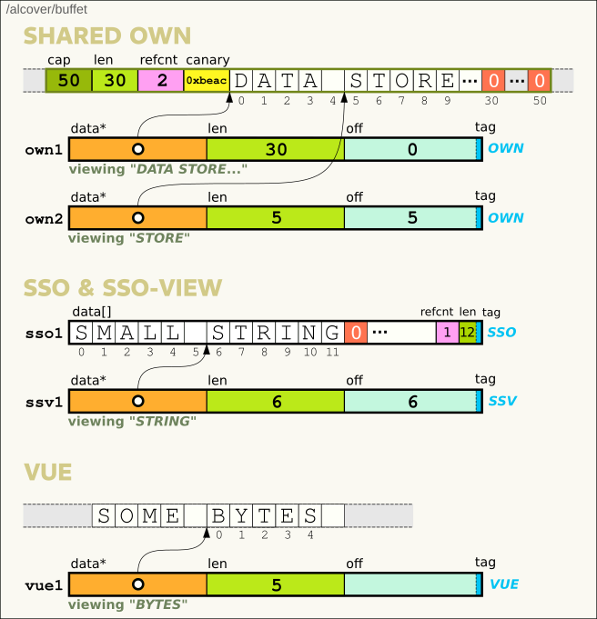

# Buffet

*All-inclusive Buffer for C*  

:orange_book: [**API**](#API)    

  

*Buffet* is a polymorphic string buffer type featuring :
- **SSO** (small string optimization) : short data stored inline
- **views** : no-cost references to slices of data  
- **reference counting** : secure release of views and owned data
- **cstr** : obtain a null-terminated C string
- automated (re)allocations

In mere register-fitting **16 bytes**.  


:construction: Caveat : still experimental  
\- not yet stable, optimized or feature-complete  
\- not yet unit-tested for *all* paths and corner-cases  
\- probably not thread-safe  

---

## How

```C
union Buffet {
        
    // OWN, REF, VUE
    struct {
        char*    data
        uint32_t len
        uint32_t aux:30, tag:2 // aux = {cap|off}
    } ptr

    // SSO
    struct {
        char     data[15]
        uint8_t  len:6, tag:2
    } sso
}
```  
The tag sets how a Buffet is interpreted :
- `SSO` : as a char array
- `OWN` : as owning heap-allocated data (with `aux` as capacity)
- `REF` : as a slice of owned data (with `aux` as offset)
- `VUE` : as a slice of other data (with `aux` as offset)

Any *proper* data (*SSO*/*OWN*) is null-terminated.  




### Build & unit-test

`make && make check`

### example

```C
#include <stdio.h>
#include "buffet.h"

int main()
{
    char text[] = "The train goes.";

    Buffet own;
    buffet_strcopy (&own, text, sizeof(text));

    Buffet ref = buffet_view (&own, 4, 5);
    buffet_print(&ref); // "train"

    buffet_append (&ref, "ing", 3);
    buffet_print(&ref); // "training"
    
    Buffet vue;
    buffet_strview (&vue, text+4, 5);
    buffet_print(&vue); // "train"

    text[4] = 'b';
    buffet_print(&vue); // "brain"

    return 0;
}
```

```
$ gcc example.c buffet -o example && ./example
train
training
train
brain
```
---

# API

[buffet_new](#buffet_new)  
[buffet_strcopy](#buffet_strcopy)  
[buffet_strview](#buffet_strview)  
[buffet_copy](#buffet_copy)  
[buffet_view](#buffet_view)  
[buffet_append](#buffet_append)  
[buffet_split](#buffet_split)  
[buffet_join](#buffet_join)  
[buffet_free](#buffet_free)  

[buffet_cap](#buffet_cap)  
[buffet_len](#buffet_len)  
[buffet_data](#buffet_data)  
[buffet_cstr](#buffet_cstr)  
[buffet_export](#buffet_export)  

[buffet_print](#buffet_print)  
[buffet_debug](#buffet_debug)  

### buffet_new
```C
void buffet_new (Buffet *dst, size_t cap)
```
Create a Buffet of capacity at least `cap`.  

```C
Buffet buf;
buffet_new(&buf, 20);
buffet_debug(&buf); 
// tag:OWN cap:32 len:0 data:''
```

### buffet_strcopy
```C
void buffet_strcopy (Buffet *dst, const char *src, size_t len)
```
Create new Buffet `dst` importing `len` bytes from string `src`.  

```C
Buffet copy;
buffet_strcopy(&copy, "Bonjour", 3);
buffet_debug(&copy); 
// tag:SSO cap:14 len:3 data:'Bon'

```

### buffet_strview
```C
void buffet_strview (Buffet *dst, const char *src, size_t len)
```
Create new Buffet `dst` viewing `len` bytes from string `src`.  
You get a window into `src`. No copy or allocation.

```C
char src[] = "Eat Buffet!";
Buffet view;
buffet_strview(&view, src+4, 3);
buffet_debug(&view);
// tag:VUE cap:0 len:6 data:'Buffet!'
buffet_print(&view);
// Buf
```

### buffet_copy
```C
Buffet buffet_copy (const Buffet *src, ptrdiff_t off, size_t len)
```
Create new Buffet importing `len` bytes from Buffet `src`, starting at offset `off`.  


### buffet_view
```C
Buffet buffet_view (const Buffet *src, ptrdiff_t off, size_t len)
```
Create new Buffet viewing `len` bytes from Buffet `src`, starting at offset `off`.  
The return is internally either 
- a *REF* if `src` is *OWN*
- a *REF* to origin if `src` is *REF*
- a *VUE* on `src` data if `src` is *SSO* or *VUE*

If a *REF* is returned, `src` now cannot be released before either  
- the return is released
- the return is detached as owner, e.g. when you `append` to it.

```C
// view own
Buffet own;
buffet_strcopy(&own, "Bonjour monsieur", 16);
Buffet ref1 = buffet_view(&own, 0, 7);
buffet_debug(&ref1); // tag:REF len:7 cstr:'Bonjour'

// view ref
Buffet ref2 = buffet_view(&ref1, 0, 3);
buffet_debug(&ref2); // tag:REF len:3 cstr:'Bon'

// detach views
buffet_append(&ref2, "net", 3);
buffet_debug(&ref2); // tag:SSO len:6 cstr:'Bonnet'
buffet_append(&ref1, "!", 1);
buffet_debug(&ref1); // tag:SSO len:8 cstr:'Bonjour!'
buffet_free(&own);   // OK

// view vue
Buffet vue;
buffet_strview(&vue, "Good day", 4);
Buffet vue2 = buffet_view(&vue, 0, 3);
buffet_debug(&vue2); // tag:VUE len:3 cstr:'Goo'

// view sso
Buffet sso;
buffet_strcopy(&sso, "Bonjour", 7);
Buffet vue3 = buffet_view(&sso, 0, 3);
buffet_debug(&vue3); // tag:VUE len:3 cstr:'Bon'
```


### buffet_free
```C
void buffet_free (Buffet *buf)
```
If `buf` is *SSO* or *VUE*, it is simply zeroed, making it an empty *SSO*.  
If `buf` is *REF*, the refcount is decremented and *buf* zeroed.  
If `buf` owns data :  
- with no references, the data is released and *buf* is zeroed
- with live references, *buf* is marked for release and waits for its last ref to be released.  


```C
char text[] = "Le grand orchestre de Patato Valdez";

Buffet own;
buffet_strcopy(&own, text, sizeof(text));
buffet_debug(&own);
// tag:OWN data:'Le grand orchestre de Patato Valdez'

Buffet ref = buffet_view(&own, 22, 13);
buffet_debug(&ref);
// tag:REF data:'Patato Valdez'

// Too soon but marked for release
buffet_free(&own);
buffet_debug(&own);
// tag:OWN data:'Le grand orchestre de Patato Valdez'

// Release last ref, hence owner
buffet_free(&ref);
buffet_debug(&own);
// tag:SSO data:''
```


### buffet_append
```C
size_t buffet_append (Buffet *dst, const char *src, size_t len)
```
Appends `len` bytes from `src` to `dst`.  
Returns new length or 0 on error.
If over capacity, `dst` gets reallocated. 

```C
Buffet buf;
buffet_strcopy(&buf, "abc", 3); 
size_t newlen = buffet_append(&buf, "def", 3); // newlen == 6 
buffet_debug(&buf);
// tag:SSO cap:14 len:6 data:'abcdef'
```


### buffet_split
```C
Buffet* buffet_split (const char* src, size_t srclen, const char* sep, size_t seplen, 
    int *outcnt)
```
Splits `src` along separator `sep` into a Buffet list of resulting length `*outcnt`.  
The list can be freed using `buffet_list_free(list, cnt)`

```C
int cnt;
Buffet *parts = buffet_split("Split me", 8, " ", 1, &cnt);
for (int i=0; i<cnt; ++i)
    buffet_debug(&parts[i]);
buffet_list_free(parts, cnt);
// tag:VUE cap:0 len:5 data:'Split me' cstr:'Split'
// tag:VUE cap:0 len:2 data:'me' cstr:'me'
```


### buffet_join
```C
Buffet buffet_join (Buffet *list, int cnt, const char* sep, size_t seplen);
```
Joins `list` on separator `sep` into a new Buffet.  

```C
int cnt;
Buffet *parts = buffet_split("Split me", 8, " ", 1, &cnt);
Buffet back = buffet_join(parts, cnt, " ", 1);
buffet_debug(&back);
// tag:SSO cap:14 len:8 data:'Split me' cstr:'Split me'
```


### buffet_cap  
Get current capacity.  
```C
size_t buffet_cap (Buffet *buf)
```

### buffet_len  
Get current length.  
```C
size_t buffet_len (Buffet *buf)`
```

### buffet_data
Get current data pointer.  
```C
const char* buffet_data (const Buffet *buf)`
```
If *buf* is a ref/view, `strlen(buffet_data)` may be longer than `buf.len`. 

### buffet_cstr
Get current data as a NUL-terminated **C string**.  
```C
const char* buffet_cstr (const Buffet *buf, bool *mustfree)
```
If *REF*/*VUE*, the slice is copied into a fresh C string that must be freed.

### buffet_export
 Copies data up to `buf.len` into a fresh C string that must be freed.
```C
char* buffet_export (const Buffet *buf)
```


### buffet_print
Prints data up to `buf.len`.
```C
void buffet_print (const Buffet *buf)`
```

### buffet_debug  
Prints *buf* state.  
```C
void buffet_debug (Buffet *buf)
```

```C
Buffet buf;
buffet_strcopy(&buf, "foo", 3);
buffet_debug(&buf);
// tag:SSO cap:14 len:3 data:'foo'
```